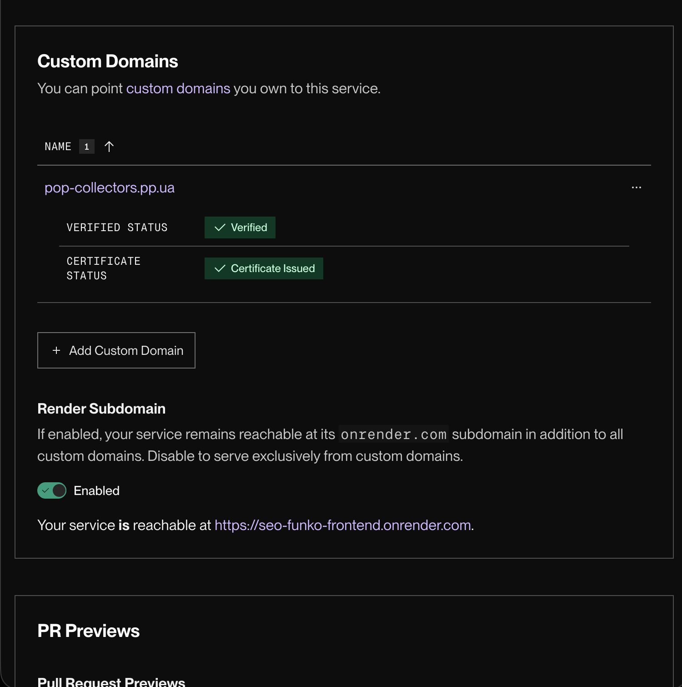

# Лабораторна робота №1. Вступ до SEO та пошукових систем

## Мета
Отримати практичний досвід розгортання вебзастосунка в production-середовищі, ознайомитись з інструментами вебмайстра та побачити на практиці, як пошукові системи взаємодіють із сайтом.

## 1. URL розгорнутого сайту на Render
seo-funko-backend.onrender.com

## 2. Назва зареєстрованого домену
https://pop-collectors.pp.ua/

## 3. Скріншот успішного deploy на Railway

## 4. Вміст файлу curl-result.txt

[Натисни сюди, щоб відкрити мій txt файл](curl-result.txt)

## 5. Порівняльна таблиця: curl vs View Source vs DevTools

У цій таблиці наведено порівняння трьох різних способів перегляду коду веб-сторінки, які демонструють різницю між серверною відповіддю та відрендереним контентом у браузері.

| Інструмент / Метод | Що показує (Джерело даних) | Чи виконує JavaScript? | Що бачить користувач/бот | Для чого використовується в SEO |
| :--- | :--- | :--- | :--- | :--- |
| **`curl`** (Командний рядок) | Сиру HTTP-відповідь від сервера (тільки те, що сервер віддав у першу секунду). | ❌ Ні | Базовий пошуковий бот (без рендерингу). | Перевірка статус-кодів (200, 301, 404), швидкості відповіді сервера та базового HTML без домішок. |
| **View Source** (Перегляд коду сторінки, `Ctrl+U`) | Той самий початковий сирий HTML-код, що і `curl`, але відкритий у вкладці браузера. | ❌ Ні | Базовий пошуковий бот. | Швидка ручна перевірка наявності мета-тегів (title, description, robots) та канонікал-лінків до того, як спрацюють скрипти. |
| **DevTools / Elements** (Панель розробника, `F12`) | Фінальний **DOM-дерево** (Document Object Model). Змінений та доповнений код. | ✅ Так | Жива людина або відрендерений Googlebot (після виконання скриптів). | Перевірка того, чи не ламає JS важливий контент, чи з'являються потрібні посилання/тексти після завантаження сторінки. |

## 6. Скріншот верифікації в Google Search Console

Знайти в отриманому HTML та заповнити таблицю:

| Елемент                     | Присутній | Що містить                             |
|-----------------------------|-----------|----------------------------------------|
| Текст статей                |    Так    | У SSR HTML є назви й описи постів      |
| `<title>`                   |    Так    | Funko Pop Store  |
| `<meta name="description">` |    Так    | Tech blog with articles cybersecurity  |
| Вміст `<body>`              |    Так    | Попередньо відрендерений список постів, навігація, контент головної сторінки та JSON-стан __REACT_QUERY_STATE__.
                                      |

## Відповідь на питання: що побачить Google crawler і чому це може бути проблемою?
Google crawler побачить попередньо відрендерений HTML із контентом сторінки (SSR), тож базовий текст, заголовки і частина метаданих доступні для індексації без JavaScript.
