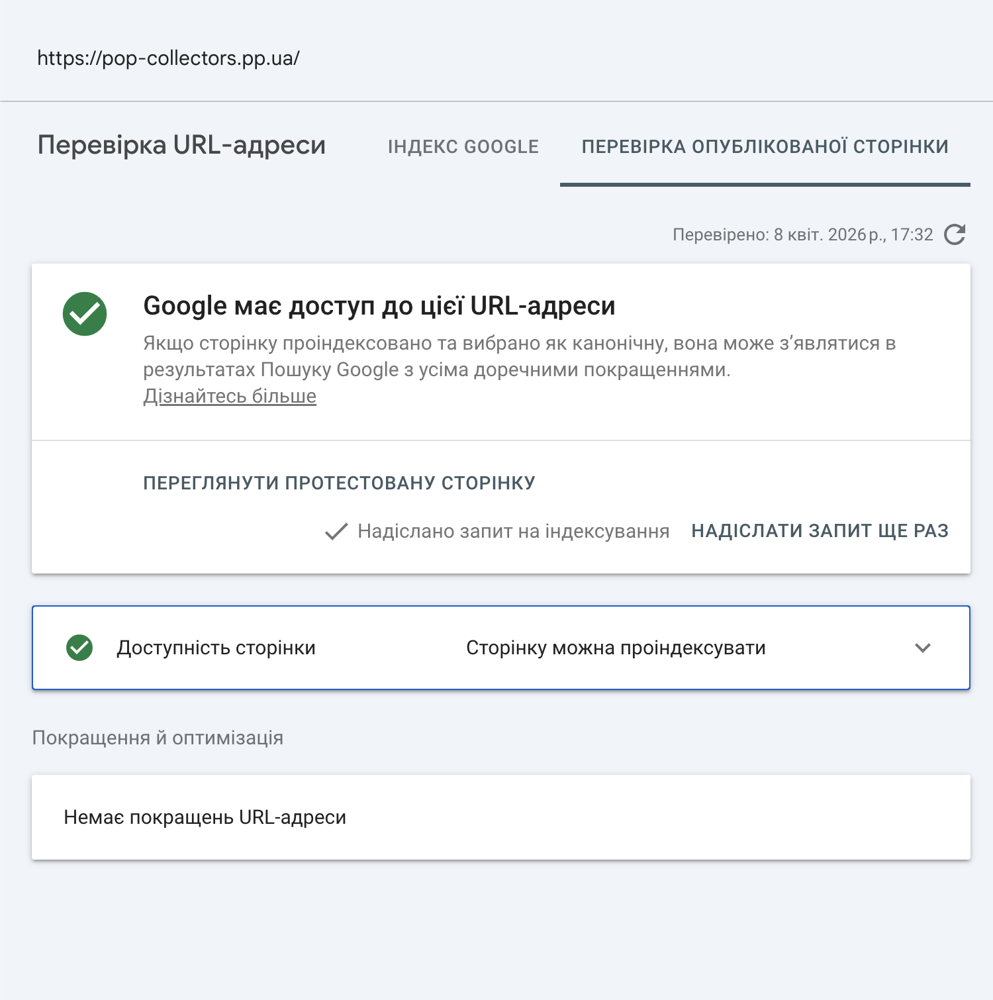

# Лабораторна робота №1. Вступ до SEO та пошукових систем

## Мета
Отримати практичний досвід розгортання вебзастосунка в production-середовищі, ознайомитись з інструментами вебмайстра та побачити на практиці, як пошукові системи взаємодіють із сайтом.

## 1. URL розгорнутого сайту на Render
seo-funko-backend.onrender.com

## 2. Назва зареєстрованого домену
https://pop-collectors.pp.ua/

## 3. Скріншот успішного deploy на Railway

## 4. Вміст файлу curl-result.txt

[Натисни сюди, щоб відкрити мій txt файл](curl-result.txt)

## 5. Порівняльна таблиця: curl vs View Source vs DevTools

Знайти в отриманому HTML та заповнити таблицю:

| Елемент                     | Присутній | Що містить                             |
|-----------------------------|-----------|----------------------------------------|
| Текст статей                |    Так    | У SSR HTML є назви й описи постів      |
| `<title>`                   |    Так    | Funko Pop Store  |
| `<meta name="description">` |    Так    | The ultimate destination for Funko Pop collectors. Shop exclusive Marvel, Formula 1, and Anime figures. Fast shipping and great deals! |
| Вміст `<body>`              |    Так    | Попередньо відрендерений список постів, навігація, контент головної сторінки та JSON-стан __REACT_QUERY_STATE__.
          

## 6. Скріншот верифікації в Google Search Console

## 7. Скріншот запиту на індексацію

                            |

## Відповідь на питання: що побачить Google crawler і чому це може бути проблемою?
Google crawler побачить попередньо відрендерений HTML із контентом сторінки (SSR), тож базовий текст, заголовки і частина метаданих доступні для індексації без JavaScript.
