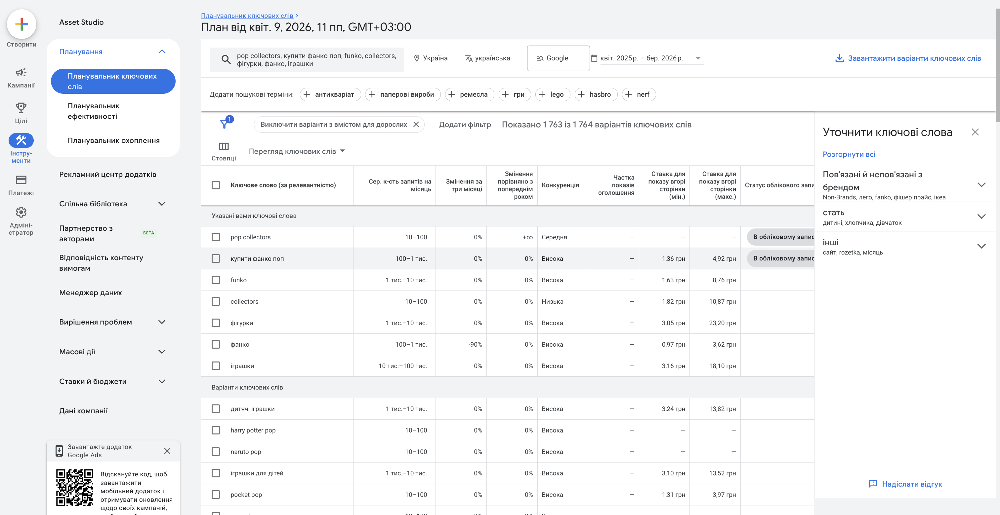
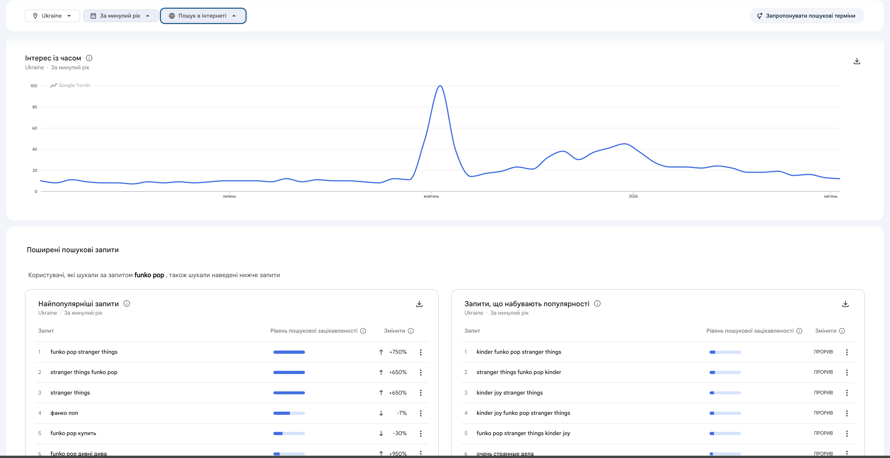

# Лабораторна робота №3. Семантичне ядро та структура сайту

---

## Мета

Навчитись збирати та класифікувати ключові слова за типом пошукового інтенту, будувати семантичне ядро у структурованому
форматі, кластеризувати запити та проектувати silo-структуру сайту на основі зібраних даних.

---

## 1. Класифікація типів пошукових запитів

**1.1 - Класифікація інтенту**
Зібрано 40 цільових пошукових запитів, які було класифіковано за чотирма типами інтенту (Informational, Navigational, Transactional, Commercial). Усі дані оформлені в Google Sheets.

👉 **[Посилання на Google Sheets (Аркуш "Keywords")](https://docs.google.com/spreadsheets/d/10dWrcG2_xBsSTDZbcCyjcSSnTZ1aZCG1xmicMolMGRo/edit?gid=0#gid=0)**

**1.2 - Аналіз через Google Search**
Результати ручного аналізу видачі Google (People also ask, Related searches, Autocomplete) для трьох ключових запитів ("як відрізнити оригінал фанко поп", "ціна на лімітовані фігурки фанко поп", "догляд за вініловими фігурками") зафіксовані та враховані при складанні ядра. Деталі знаходяться у Google Sheets.

👉 **[Посилання на Google Sheets (Аркуш "Аналіз через Google Search")](https://docs.google.com/spreadsheets/d/10dWrcG2_xBsSTDZbcCyjcSSnTZ1aZCG1xmicMolMGRo/edit?gid=831334052#gid=831334052)**

**1.3 - Збір через Google Keyword Planner**
Було використано інструмент Google Keyword Planner для пошуку нових ідей та збору "сирих" ключових слів (регіон: Україна).

**1.4 - Розширення через Google Trends**
Проведено аналіз сезонності попиту. 

---

## 2. Кластеризація запитів

Усі запити були згруповані за спільним пошуковим інтентом. Створено 10 тематичних кластерів (наприклад, `marvel-catalog`, `funko-accessories`), кожен з яких відповідає конкретній цільовій сторінці сайту.

👉 **[Посилання на Google Sheets (Аркуш "Clusters")](https://docs.google.com/spreadsheets/d/10dWrcG2_xBsSTDZbcCyjcSSnTZ1aZCG1xmicMolMGRo/edit?gid=1522766793#gid=1522766793)**

---

## 3. Побудова Silo-структури сайту

На основі розроблених кластерів побудовано логічну Silo-структуру сайту, яка поділяє контент на комерційну та інформаційну вертикалі.

👉 **[Посилання на Google Sheets (Аркуші "Structure" та "InternalLinks")](https://docs.google.com/spreadsheets/d/10dWrcG2_xBsSTDZbcCyjcSSnTZ1aZCG1xmicMolMGRo/edit?gid=2055638201#gid=2055638201)**

### 4 - Перевірка структури (Контрольні питання)

**1. Чи кожна категорія є окремим тематичним силосом?**
Так. Структура сайту має дві чіткі вертикалі (силоси). Комерційний силос (`/catalog/...`) містить лише товари та категорії для покупок (Marvel, Anime, Accessories). Інформаційний силос (`/articles/...`) містить лише експертні статті (наприклад, гайд по стікерам).

**2. Чи є перехресні посилання між різними силосами?**
Так, перехресні посилання є, і вони логічно виправдані. Наприклад, з інформаційної статті про стікери (`/articles/funko-stickers-explained`) стоїть контекстне посилання на комерційну категорію `/catalog/marvel`, щоб користувач міг одразу придбати фігурки, про які щойно прочитав.

**3. Яка максимальна глибина кліків від головної до будь-якої статті?**
Максимальна глибина становить 2 кліки (рівень вкладеності 3).
Приклад: Головна сторінка (`/`) ➔ 1 клік ➔ Сторінка блогу (`/articles`) ➔ 2 клік ➔ Стаття про стікери (`/articles/funko-stickers-explained`).

**4. Чи є orphan pages - сторінки без жодного вхідного посилання?**
Ні, сторінок-сиріт немає. Усі створені сторінки, включаючи статичну сторінку `/about`, інтегровані в загальну структуру через головне меню, футер, хлібні крихти (breadcrumbs) або контекстну перелінковку зі статей.
