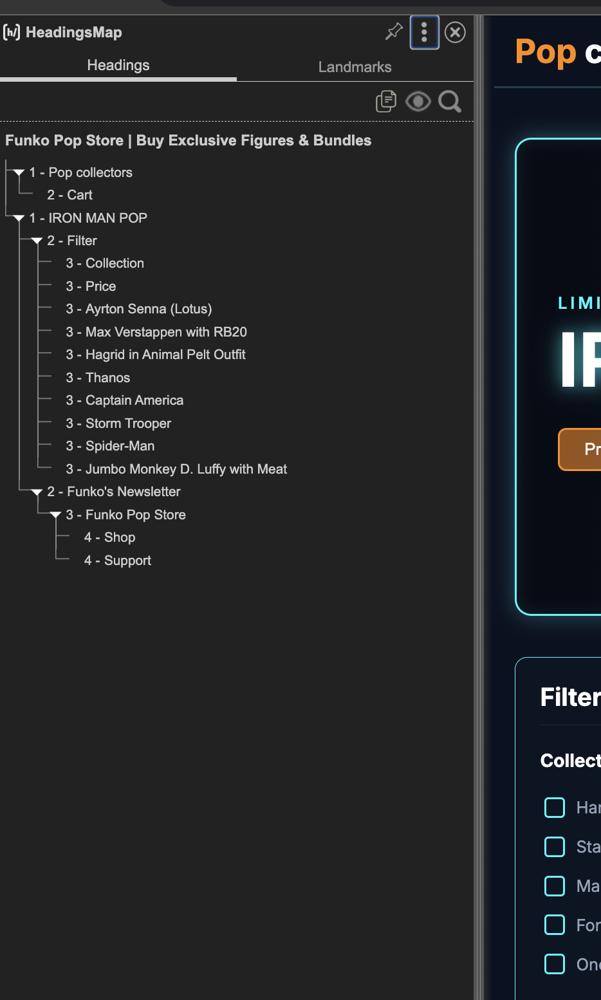
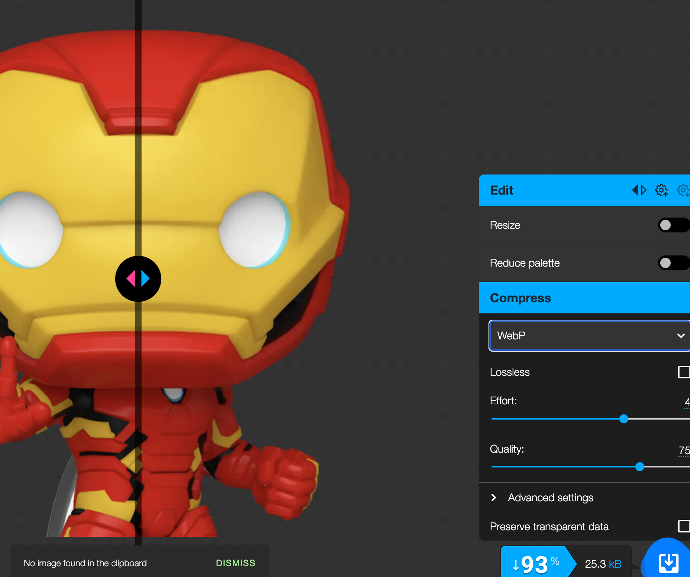
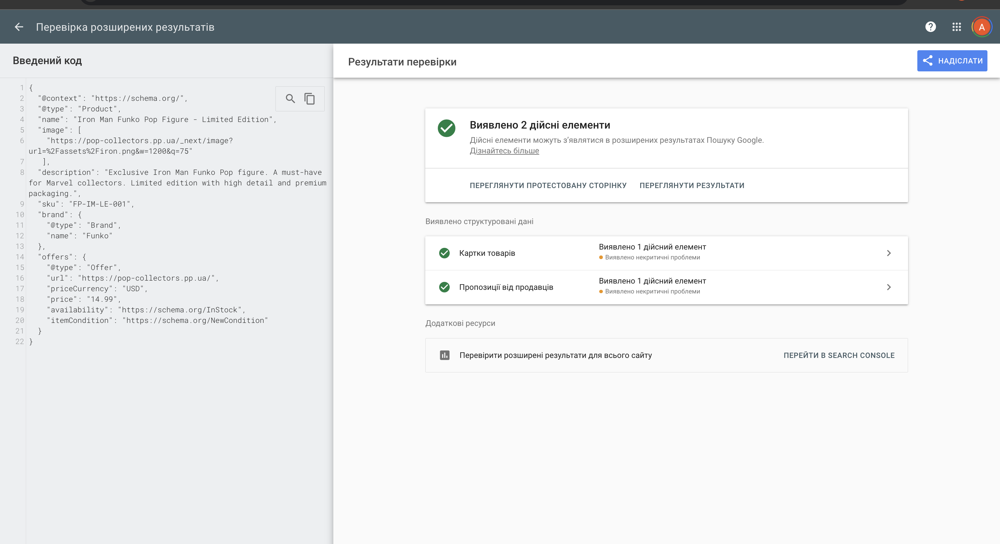
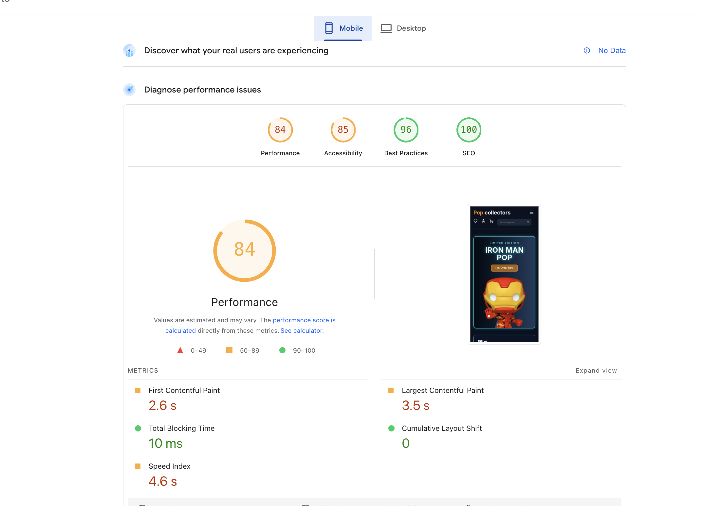
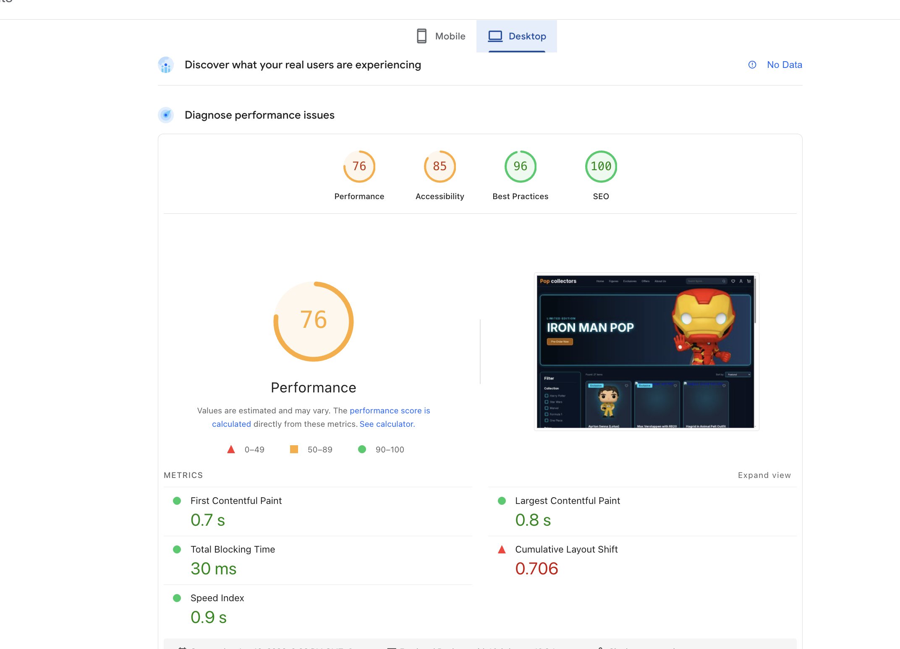

# Лабораторна робота №4. Контент і On-Page SEO

---

## Мета

Навчитись оптимізувати сторінки сайту відповідно до вимог on-page SEO: правильно формувати мета-теги, заголовки та
URL-структуру, писати SEO-текст для реальної аудиторії, додавати структуровані дані Schema.org та перевіряти
релевантність сторінки цільовому запиту за допомогою спеціалізованих інструментів.

---
## 1. Технічний аудит та базові налаштування

| Елемент            | Поточне значення         | Відповідає нормі? | Проблема |
|--------------------|--------------------------|-------------------|----------|
| `<title>`          |Funko Pop Store Buy Exclusive Figures & Bundles (51 симв.)| Так|Довжина в межах норми, ключові слова присутні.|
| `meta description` |The ultimate destination for Funko Pop collectors. Shop exclusive Marvel, Formula 1, and Anime figures... (144 симв.)| Ні |Трохи закороткий (бажано 150–160), не вистачає чіткого заклику до дії.|
| `H1`               |Pop collectors (лого) та IRON MAN POP (Hero)| Ні          |Дублювання H1.|
| Кількість H2       |3 (Cart, Filter, Funko's Newsletter)|  Ні |H2 використано для системних назв, а не для контенту.|
| URL                |https://pop-collectors.pp.ua| Так          |нижній регістр, без зайвих параметрів.|
| Alt у зображень    | є| так| Всі зображення товарів мають описовий Alt.|
| Schema.org         |  відсутня             |  Ні          | Пошукові системи не отримують структурованих даних про товари (ціна, наявність), що унеможливлює відображення розширених сніпетів у видачі.|
| Canonical          |  відсутній            |  Ні          | Не визначено пріоритетну версію сторінки, що створює ризик появи дублів та розпилення посилальної ваги.|


## 2. Оптимізовані title, description, H1, URL і тд

На основі проведеного аудиту (п.1.1) було розроблено оптимізовані варіанти мета-тегів для підвищення релевантності сторінки у пошуковій видачі Google.

**Title:**
```
До:  Funko Pop Store | Buy Exclusive Figures & Bundles
Після: Funko Pop Store: Buy Exclusive Figures & Bundles
Довжина: 56 символів (норма 50–60)
Позиція ключового слова: перші 3 слова
```

**Meta description:**
```
До: The ultimate destination for Funko Pop collectors. Shop exclusive Marvel, Formula 1, and Anime figures.
Fast shipping and great deals!
Після: Looking for rare Funko Pop figures? Shop our exclusive Marvel, Anime, and F1 collections.
Enjoy fast shipping and best prices. Order now and grow your collection!
Довжина: 160 символів (норма 150–160)
Є CTA (заклик до дії): Так (Order now)
```

**H1:**
```
До: Pop collectors (в логотипі) та IRON MAN POP
Після: Pop collectors
Містить цільовий запит: Так
```

**URL:**
```
До: https://pop-collectors.pp.ua/
Після: https://pop-collectors.pp.ua/
Зміни: URL головної сторінки відповідає нормам (короткий, на безпечному протоколі HTTPS,
без зайвих параметрів), тому змін не потребує.
```


## 3. Оптимізація структури заголовків зі скріншотом HeadingsMap

**Поточна структура (Before):**
На скріншоті нижче зафіксовано поточний стан заголовків.


**Оптимізована структура (After):**
```
H1: Pop collectors (Головний ключ)
  H2: Featured: Iron Man Limited Edition (Акційний товар)
  H2: Shop Funko Pop Collections (Заголовок каталогу)
    H3: Ayrton Senna (Lotus)
    H3: Max Verstappen with RB20
    H3: Spider-Man Premium Figure
  H2: Filters & Search (Блок навігації)
  H2: Join Our Community (Футер)
    H3: Newsletter Subscription
```
У заголовки H2 закладено середньочастотні запити («Funko Pop Collection», «Limited Edition»), а в H3 — низькочастотні назви конкретних героїв та франшиз («Iron Man», «Marvel», «Formula 1»), що дозволяє сторінці охоплювати максимально широкий спектр цільового трафіку.


## 4. Таблиця оптимізації зображень + скріншот Squoosh

| Зображення   | Поточний alt | Поточний формат | Розмір файлу | Оптимізований alt | Рекомендований формат |
|--------------|--------------|-----------------|--------------|-------------------|-----------------------|
| зображення 1 |Iron Man Pop Figure Limited Edition|PNG| 369 КБ | Iron Man Funko Pop Figure Limited Edition Collectible|WebP|
| зображення 2 |Ayrton Senna (Lotus)|PNG| 85 КБ|Ayrton Senna Lotus 97T Funko Pop Formula 1 Figure|                   WebP|
| зображення 3 |Max Verstappen with RB20| PNG|312 КБ |Max Verstappen Red Bull RB20 Funko Pop Collectible|                    WebP|




## 5. JSON-LD розмітка + скріншот Rich Results Test 
Для покращення представлення сайту у пошуковій видачі (створення розширеного сніпета) було розроблено мікророзмітку у форматі JSON-LD. Обрано тип Product, оскільки на сторінці представлено конкретний товар з ціною та наявністю.

```json
{
  "@context": "https://schema.org/",
  "@type": "Product",
  "name": "Iron Man Funko Pop Figure - Limited Edition",
  "image": [
    "https://pop-collectors.pp.ua/_next/image?url=%2Fassets%2Firon.png&w=1200&q=75"
   ],
  "description": "Exclusive Iron Man Funko Pop figure. A must-have for Marvel collectors. Limited edition with high detail and premium packaging.",
  "sku": "FP-IM-LE-001",
  "brand": {
    "@type": "Brand",
    "name": "Funko"
  },
  "offers": {
    "@type": "Offer",
    "url": "https://pop-collectors.pp.ua/",
    "priceCurrency": "USD",
    "price": "14.99",
    "availability": "https://schema.org/InStock",
    "itemCondition": "https://schema.org/NewCondition"
  }
}
```



## 6. Аналіз конкурентів 

| Параметр                     | Конкурент 1 | Конкурент 2 |
|------------------------------|-------------|-------------|
| URL                          |retromagaz.com |worldofcomics.ua| worldofcomics.ua |
| Приблизна кількість слів     |~750 слів (SEO-текст під товарами)|~500 слів|             
| Чи є особистий досвід        | Ні    | Ні    | 
| Чи є структуровані дані      | Так (Product, Breadcrumbs)  | Так    |
| Які H2 використовують        |  АКЦІЙНІ ПРОПОЗИЦІЇ, ТІЛЬКИ ЕКСКЛЮЗИВИ| Чому комікси стали так популярними?, Як уникнути помилок при виборі коміксів? |             
| Що відсутнє у їхньому тексті | Детальна інформація про рідкісні та ексклюзивні серії (F1, Anime).|             |             


## 7. SEO-текст + таблиця вимог 

**Цільовий запит: ```Funko Pop Store```**

```
Ексклюзивний Funko Pop Store: Твій хаб рідкісних фігурок
Ласкаво просимо до нашого Funko Pop Store, місця, де пристрасть до поп-культури зустрічається з мистецтвом колекціонування. Незалежно від того, чи ви досвідчений "про" з сотнями екземплярів на полицях, чи новачок, який шукає свою першу вінілову фігурку, пошук надійного джерела — це перший крок у вашій подорожі. У 2026 році світ колекціонування вийшов далеко за межі звичайних іграшок; він перетворився на глобальну спільноту ентузіастів, які цінують автентичність, рідкість та азарт полювання. У нашому магазині ми розуміємо, що кожна коробка розповідає історію, а кожна наклейка додає цінності вашій колекції.

Рідкісні ексклюзиви Marvel та Anime у нашому Funko Pop Store
Серце кожного справжнього Funko Pop Store — це його різноманітність. Ми пишаємося тим, що знаходимо найбажаніші фігурки з усіх мультивсесвітів. Наш каталог містить широкий спектр легенд Marvel: від класичних Месників до останніх кінематографічних ітерацій. Наприклад, наша лімітована фігурка Залізної Людини (Iron Man) залишається справжньою перлиною для фанатів MCU. Але ми не обмежуємося лише супергероями.

Секція аніме переживає величезний сплеск популярності, а фігурки формату "Jumbo", такі як Монкі Д. Луффі з One Piece, стають центральними об’єктами колекцій. Ми уважно стежимо за ринковими тенденціями, щоб гарантувати: коли фігурка отримує статус "vaulted" (знімається з виробництва), у нас уже є зарезервований запас для постійних клієнтів. Колекціонування — це більше, ніж просто купівля; це фіксація моменту в історії культури.

Чому оригінальність та "Mint Condition" мають значення
У світі високовартісних колекційних предметів оригінальність — це все. Спираючись на наш багаторічний досвід у цьому хобі, ми спостерігаємо приплив високоякісних реплік на ринок. Щоб захистити нашу спільноту, ми впровадили суворий процес перевірки. Важлива експертна порада для колекціонерів: завжди перевіряйте серійний номер (зазвичай починається з JJL, FAC або DRM) на дні коробки; він обов'язково має збігатися зі штампом на стопі або голові самої фігурки.

Ми надаємо пріоритет стану пакування "Mint Condition", адже знаємо, що для справжнього колекціонера коробка так само важлива, як і сама вінілова фігурка. Кожне замовлення з нашого Funko Pop Store пакується в надміцну повітряно-бульбашкову плівку та захисні протектори, щоб ваш інвестиційний актив прибув у бездоганному стані, без заломів на кутах чи подряпин на прозорому вікні.

Від Formula 1 до рідкісних "граалів": розширюй свої горизонти
Хоча Marvel та Star Wars залишаються класикою, у 2026 році ландшафт колекціонування охопив нові ніші. Наша спеціалізована колекція Formula 1, де представлені такі легенди, як Айртон Сенна та Макс Ферстаппен, заповнює прогалину між спортивною атрибутикою та поп-культурою. Ці фігурки часто мають менші наклади, що робить їх "граалями" — рідкісними предметами, вартість яких значно зростає з часом.

Урізноманітнюючи свою колекцію різними жанрами, ви не тільки робите свою експозицію цікавішою, але й створюєте більш стійкий інвестиційний портфель. Ми постійно оновлюємо розділ "Новинки", щоб включити ці затребувані кросоверні фігурки до того, як вони потраплять на вторинний ринок за завищеними цінами.

Приєднуйся до спільноти Pop Collectors вже сьогодні
Початок або розширення колекції має бути захоплюючим досвідом без зайвих стресів. Наша місія — надати вам кураторську добірку найкращих вінілових фігурок, які може запропонувати світ. Не дозвольте рідкісному "chase" варіанту вислизнути з ваших рук!

Готові знайти свій наступний "грааль"? Перегляньте нашу повну колекцію прямо зараз та скористайтеся швидкою доставкою. Ваша нова улюблена фігурка вже чекає на вас!
```

| Вимога                     | Виконано? | Де саме в тексті     |
|----------------------------|-----------|----------------------|
| Запит у H1                 | Так  | <h1>Ексклюзивний Funko Pop Store: Твій хаб рідкісних фігурок</h1> |
| Запит у першому абзаці     | Так   | «Ласкаво просимо до нашого Funko Pop Store, місця, де пристрасть до поп-культури...»|
| Запит у мінімум 1 H2       | Так  | <h2>Рідкісні ексклюзиви Marvel та Anime у нашому Funko Pop Store</h2>  |
| 5+ LSI-варіацій            | Так  | вінілова фігурка, колекційні предмети, статус vaulted, Mint Condition, chase варіант |
| E-E-A-T сигнал  | Так   | перевіряйте серійний номер (JJL, FAC або DRM) на дні коробки; він має збігатися зі штампом на стопі|
| Заклик до дії              | Так  | «Перегляньте нашу повну колекцію прямо зараз та скористайтеся швидкою доставкою.» |
| Відсутній keyword stuffing | Так  |Показник щільності складає 1.03%|

**Перевірка на keyword stuffing**
```
Загальна кількість слів у тексті: 485
Кількість входжень цільового запиту: 5
Щільність: 1.03%
```


##8. Таблиця Core Web Vitals + скріншот PageSpeed Insights

Аналіз проведено для головної сторінки https://pop-collectors.pp.ua/. Результати показують різницю між десктопною та мобільною версіями, що зумовлено швидкістю обробки JS-скриптів та завантаженням графіки.




Рекомендації щодо оптимізації («Opportunities»):
Впровадження сучасних форматів зображень (WebP/AVIF) — Необхідно виконати конвертацію графічних ресурсів із формату PNG у WebP або AVIF. Це дозволить суттєво зменшити вагу сторінки, що є критично важливим для покращення показника LCP 

Задання чітких атрибутів розмірів для зображень (width та height) — Для усунення незадовільного показника CLS на десктопній версії (0.706) необхідно вказати явні параметри ширини та висоти для кожного медіаелемента. Це дозволить браузеру зарезервувати місце під зображення до його завантаження, що запобігатиме раптовим змінам макета сторінки.

Оптимізація розмірів відповідно до пристроїв (Properly size images) — Потрібно налаштувати адаптивну видачу зображень через атрибут srcset. Це допоможе уникнути завантаження файлів із надлишковою роздільною здатністю на мобільних пристроях, що сприятиме зменшенню часу завантаження контенту та покращенню показника Speed Index.

## 9. Перевірка canonical

Для перевірки наявності канонічної адреси було використано інструменти розробника (DevTools) та аналіз вихідного коду сторінки.

**Результати пошуку тегу:**
```
Метод перевірки: Elements → Ctrl+F → пошук за ключовим словом "canonical".
Відсутній (тег <link rel="canonical"> у секції <head> не виявлено).
```
Для запобігання появі дублів та консолідації "посилальної ваги" на головній сторінці, необхідно додати у секцію ```<head>``` наступний тег:

```html
<link rel="canonical" href="https://pop-collectors.pp.ua/"/>
```

## 10. Таблиця канібалізації з рішеннями 

Для аналізу було обрано 3 ключові запити з семантичного ядра (Лабораторна робота №3). Перевірка проводилась за допомогою оператора site:pop-collectors.pp.ua "запит".


| Цільовий запит | Кількість URL у результаті | Список URL | Є канібалізація? |
|----------------|----------------------------|------------|------------------|
| що таке фанко поп | 2 | ```...articles/funko-stickers-explained ```| Ні         |
| купити фанко поп залізна людина| 3 | ```.../``` (головна), ```.../shop/marvel``` | Так          |
|pop collectors про нас| 1 | ```.../about ```| Ні         |

канібалізація виявлена - ```купити фанко поп залізна людина```

| Конфліктні URL | Обраний метод                              | Обґрунтування |
|----------------|--------------------------------------------|---------------|
| ```.../``` (головна), 
```.../shop/marvel```,
```.../product/iron-man```  | Differentiate / Canonical |головну сторінку оптимізувати під брендові запити, категорію Marvel — під групові запити, а конкретний комерційний запит «купити залізну людину» закріпити за сторінкою товару за допомогою тегу Canonical та внутрішньої перелінковки.|

## 11. Підсумкова SEO-картка сторінки
```
URL сторінки: https://pop-collectors.pp.ua/
Цільовий запит: Funko Pop Store
Пошуковий інтент: Transactional (Транзакційний — націлений на купівлю товару)
---

Title (оптимізований): Funko Pop Store: Buy Exclusive Figures & Bundles
Meta description: Looking for rare Funko Pop figures? Shop our exclusive Marvel, Anime, and F1 collections. Enjoy fast shipping and best prices. Order now and grow your collection!
H1: Pop collectors
Canonical: https://pop-collectors.pp.ua/
---

Кількість слів у тексті: 485
Щільність ключового слова: 1.03%
Schema.org тип: Product
Rich Results Test: пройдено (виявлено дійсні елементи для Merchant Listings та Product Snippets)
---

PageSpeed Performance (mobile): 84
LCP: 3.5 с
Статус Core Web Vitals: Needs Improvement (потребує покращення показника LCP на Mobile та CLS на Desktop)
---

Виявлені канібалізації: є (конфлікт за запитом «купити фанко поп залізна людина» між головною, категорією та товаром)
Зображення конвертовано: Так (кількість: 3 основних зображення каталогу підготовлено до формату WebP)
```


